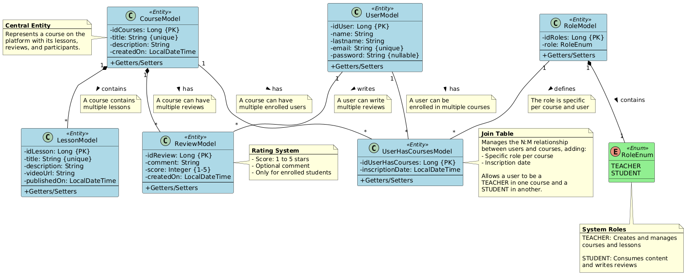

<a id="readme-top"></a>

<!-- PROJECT SHIELDS -->
<div align="center">

[![Contributors][contributors-shield]][contributors-url]
[![Forks][forks-shield]][forks-url]
[![Stargazers][stars-shield]][stars-url]
[![Issues][issues-shield]][issues-url]
[![LinkedIn][linkedin-shield]][linkedin-url]

</div>

<!-- PROJECT LOGO -->
<br />
<div align="center">
  <a href="#">
    
  </a>

<h3 align="center">Course Management API</h3>

  <p align="center">
    <a href="#api-documentation"><strong>Explore the documentation »</strong></a>
    <br />
    <br />
    <a href="#project-architecture">View Architecture</a>
    &middot;
    <a href="#technologies-used">Technologies</a>
    &middot;
    <a href="#contributing">Contribute</a>
  </p>
</div>

> 🚀 **Under Development:** This API will continue to grow over time, incorporating new functionalities, performance improvements, and updates to offer a more complete and efficient experience.

🌐 **Access the application:**

- **Development:** [https://course-management-dev.onrender.com/swagger-ui/index.html](https://course-management-dev.onrender.com/swagger-ui/index.html)
- **Staging:** [https://course-management-stg.onrender.com/swagger-ui/index.html](https://course-management-stg.onrender.com/swagger-ui/index.html)
- **Production:** [https://course-management-prod.onrender.com/swagger-ui/index.html](https://course-management-prod.onrender.com/swagger-ui/index.html)

> **Note:** The API is deployed on Render's free tier. The instance may go to sleep due to inactivity. The first request might take up to a minute to process while the server wakes up. Please be patient.

---

<details>
  <summary>Table of Contents</summary>
  <ol>
    <li><a href="#about-the-project">About the Project</a></li>
    <li><a href="#project-architecture">Project Architecture</a></li>
    <li><a href="#available-modules">Available Modules</a></li>
    <li><a href="#technologies-used">Technologies Used</a></li>
    <li><a href="#security">Security</a></li>
    <li><a href="#installation-and-setup">Installation and Setup</a></li>
    <li><a href="#running-with-docker">Running with Docker</a></li>
    <li><a href="#api-documentation">API Documentation</a></li>
    <li><a href="#deployment-cicd">Deployment and CI/CD</a></li>
    <li><a href="#contributing">Contributing</a></li>
    <li><a href="#contact">Contact</a></li>
  </ol>
</details>

---

<a id="about-the-project"></a>
## About the Project

**Course Management API** is a robust backend solution for comprehensive management of an e-learning platform. It allows instructors and students to interact in an educational ecosystem where content can be created, published, searched, and consumed efficiently and securely.

## What does the API allow you to do?

- **Create and manage courses:** Instructors (with `TEACHER` role) can create, update, and delete their own courses, defining titles and descriptions.
- **Manage educational content (Lessons):** Within each course, instructors can add, modify, and delete lessons to structure their teaching material.
- **User enrollment in courses:** The system allows users to enroll in courses with specific roles (`TEACHER` or `STUDENT`). A user's role is course-specific, meaning they can be a `STUDENT` in one course and a `TEACHER` in another, controlling their access and permissions for each course individually.
- **Publish and manage reviews:** Students (with `STUDENT` role) can publish reviews and ratings for courses they are enrolled in, fostering feedback and community.
- **Explore and search courses:** Users can search for available courses on the platform, facilitating the discovery of new content.
- **Authentication and user management:** Supports a secure authentication system with registration and login via email/password, as well as social login with Google. Endpoint security is managed with JWT.

## Notable technical features

- **RESTful API:** Design based on REST principles with clean and scalable architecture.
- **API Versioning:** The API is versioned (`/api/v1/**`) to ensure backward compatibility and allow controlled evolution of endpoints without breaking existing integrations.
- **Facade Pattern:** Implementation of the Facade design pattern in the service layer to simplify interaction with complex subsystems, providing a unified interface and cleaner, more maintainable code.
- **Swagger/OpenAPI Documentation:** All endpoints are exhaustively documented with examples, validations, and error cases.
- **Robust validations:** Use of Bean Validation (Hibernate Validator) and custom validations to ensure data integrity.
- **Security:** JWT authentication, role-based access control and course-specific permissions, OAuth2 integration (Google), and secure session handling.
- **Modular architecture:** Clear separation by domains (users, courses, lessons, reviews, authentication) following clean architecture principles.
- **Multi-environment:** Support for development, staging, and production profiles with independent configurations.
- **Automated CI/CD:** Complete pipeline with GitHub Actions including build, test, Docker build/push, and automatic deployment to Render.

<p align="right">(<a href="#readme-top">back to top</a>)</p>

<a id="project-architecture"></a>
## 🏗️ Project Architecture

The project follows a **modular architecture by domains**, organizing code into clearly defined layers:

### 📐 UML Class Diagram



*The diagram illustrates the main entities and their relationships in the database model.*

### 📁 Project Structure

```
course_management/
├── src/
│   ├── main/
│   │   ├── java/com/github/martinalexis/course_management/
│   │   │   ├── CourseManagementApplication.java  # Entry point
│   │   │   ├── auth/                              # Authentication module
│   │   │   │   ├── controller/v1/                 # REST controllers
│   │   │   │   ├── service/                       # Business logic
│   │   │   │   ├── dto/                           # Data Transfer Objects
│   │   │   │   ├── mapper/                        # MapStruct mappers
│   │   │   │   ├── filter/                        # JWT Filter
│   │   │   │   ├── handler/                       # Exception handlers
│   │   │   │   ├── entryPoint/                    # Authentication entry point
│   │   │   │   └── exceptions/                    # Custom exceptions
│   │   │   ├── user/                              # Users module
│   │   │   │   ├── controller/v1/                 # REST controllers
│   │   │   │   ├── service/                       # Business logic
│   │   │   │   ├── model/                         # JPA entities
│   │   │   │   ├── repository/                    # JPA repositories
│   │   │   │   ├── dto/                           # DTOs
│   │   │   │   ├── mapper/                        # MapStruct mappers
│   │   │   │   └── exception/                     # Custom exceptions
│   │   │   ├── course/                            # Courses module
│   │   │   │   ├── controller/v1/                 # REST controllers
│   │   │   │   ├── service/                       # Business logic
│   │   │   │   ├── model/                         # JPA entities
│   │   │   │   ├── repository/                    # JPA repositories
│   │   │   │   ├── dto/                           # DTOs
│   │   │   │   ├── mapper/                        # MapStruct mappers
│   │   │   │   └── exception/                     # Custom exceptions
│   │   │   ├── lesson/                            # Lessons module
│   │   │   │   ├── controller/v1/                 # REST controllers
│   │   │   │   ├── service/                       # Business logic
│   │   │   │   ├── model/                         # JPA entities
│   │   │   │   ├── repository/                    # JPA repositories
│   │   │   │   └── dto/                           # DTOs
│   │   │   ├── review/                            # Reviews module
│   │   │   │   ├── controller/v1/                 # REST controllers
│   │   │   │   ├── service/                       # Business logic
│   │   │   │   ├── model/                         # JPA entities
│   │   │   │   ├── repository/                    # JPA repositories
│   │   │   │   └── dto/                           # DTOs
│   │   │   ├── config/                            # Configurations
│   │   │   │   ├── SecurityConfig.java            # Security configuration
│   │   │   │   ├── SwaggerConfig.java             # Swagger configuration
│   │   │   │   └── OAuth2Config.java              # OAuth2 configuration
│   │   │   └── common/                            # Shared components
│   │   │       └── exception/                     # Global exception handling
│   │   └── resources/
│   │       ├── application-dev.properties         # Development configuration
│   │       ├── application-stg.properties         # Staging configuration
│   │       └── application-prod.properties        # Production configuration
│   └── test/                                      # Tests (mirrored structure)
├── .github/
│   └── workflows/
│       └── pipeline-course.yml                    # CI/CD Pipeline
├── Dockerfile                                     # Multi-stage Dockerfile
├── docker-compose.yml                             # Docker Compose configuration
├── pom.xml                                        # Maven dependencies
└── README.md                                      # This file
```

### Architecture Layers

1. **Controller (Presentation Layer):** Exposes REST endpoints and handles HTTP requests.
2. **Service (Business Layer):** Contains business logic and orchestrates operations. Implements the **Facade** pattern to provide a simplified interface to complex operations.
3. **Repository (Persistence Layer):** Handles communication with the database using Spring Data JPA.
4. **Model (Entities):** Represents database tables.
5. **DTO (Data Transfer Objects):** Objects for data transfer between layers.
6. **Mapper:** Converts between entities and DTOs using MapStruct.

### Implemented Design Patterns

- **Facade Pattern:** Simplifies service complexity by providing a unified interface for sets of interfaces in the subsystem.
- **Repository Pattern:** Abstracts data access logic through Spring Data JPA.
- **DTO Pattern:** Separates internal data representation from external exposure.
- **Dependency Injection:** Dependency injection managed by Spring Framework.

<p align="right">(<a href="#readme-top">back to top</a>)</p>

<a id="available-modules"></a>
## 📚 Available Modules

### Authentication (`/api/v1/auth`)
- **User registration:** Create account with email and password
- **Local login:** Authentication with credentials
- **Google OAuth2 login:** Social authentication
- **Refresh Token:** JWT token renewal

### Users (`/api/v1/users`)
- **Profile management:** Query and update user information
- **User listing:** Administrative operations

### Courses (`/api/v1/courses`)
- **Course CRUD:** Create, read, update, and delete courses
- **Search and filtering:** Find available courses
- **Enrollment:** Enroll users in courses with specific roles
- **Permission management:** Control based on user's role in each course

### Lessons (`/api/v1/lessons`)
- **Lesson CRUD:** Manage content for each course
- **Course linking:** Organize lessons within courses
- **Videos and materials:** URLs to multimedia content

### Reviews (`/api/v1/reviews`)
- **Publish reviews:** Students can rate courses
- **Ratings:** 1 to 5 star rating system
- **Comments:** Detailed feedback about courses

<p align="right">(<a href="#readme-top">back to top</a>)</p>

<a id="technologies-used"></a>
## 🔧 Technologies Used

### Backend
-  **Java 17** - Programming language
-  **Spring Boot 3.5.4** - Main framework
-  **Spring Security** - Authentication and authorization
-  **Spring Data JPA** - Data persistence
-  **Hibernate** - ORM
-  **MapStruct 1.6.3** - Object-to-object mapping
-  **Lombok** - Boilerplate code reduction
-  **Bean Validation** - Validations

### Security and Authentication
-  **JJWT 0.12.6** - JWT tokens
-  **OAuth2 Client** - Google login

### Documentation
-  **SpringDoc OpenAPI 2.8.9** - Interactive API documentation

### Database
-  **PostgreSQL 42.7.7** - Relational database
-  **Neon** - Serverless PostgreSQL for hosting

### Build and Deployment
-  **Maven 3** - Dependency and build management
-  **Docker** - Containerization
-  **GitHub Actions** - CI/CD
-  **Render** - Hosting and deployment

<p align="right">(<a href="#readme-top">back to top</a>)</p>

<a id="security"></a>
## 🔒 Security

### Authentication
- **JWT (JSON Web Tokens):** Access tokens with configurable expiration (default 24 hours)
- **Refresh Tokens:** Renewal tokens with longer duration (default 7 days)
- **OAuth2 with Google:** Integrated social login to facilitate access
- **Password Encoding:** Passwords are stored hashed with BCrypt

### Authorization
- **Course-specific roles:** Permission system based on roles (`TEACHER`, `STUDENT`)
- **Granular control:** Permissions are validated per course, allowing a user to have different roles in different courses
- **Security Context:** Each authenticated request maintains the user's security context

### Endpoint Protection
- **JWT Filter:** Intercepts and validates all requests to protected endpoints
- **Authentication Entry Point:** Custom handling of authentication errors
- **Exception Handlers:** Centralized handling of security exceptions

<p align="right">(<a href="#readme-top">back to top</a>)</p>

<a id="installation-and-setup"></a>
## 🛠️ Installation and Setup

### Prerequisites

- **Java 17 or higher**
- **Maven 3.6+**
- **PostgreSQL** (for production) - The project uses **Neon** as a serverless PostgreSQL database server
- **Docker** (optional, to run with containers)
- **Git**

### 1. Clone the repository

```bash
git clone https://github.com/martin-alexis/course_management.git
cd course_management
```

### 2. Configure environment variables

The project uses **Spring profiles** (`dev`, `stg`, `prod`) with separate configuration files:

- `application-dev.properties` - Development
- `application-stg.properties` - Staging
- `application-prod.properties` - Production

**Note:** The `.properties` files are in `.gitignore` for security. You must create your own file based on the following variables:

#### Structure of the `application-{profile}.properties` file:

```properties
# Server configuration
server.port=${PORT:8080}

# Database configuration
spring.datasource.url=${DB_URL}
spring.datasource.driver-class-name=org.postgresql.Driver

# JPA/Hibernate configuration
spring.jpa.hibernate.ddl-auto=update
spring.jpa.show-sql=true
spring.jpa.properties.hibernate.format_sql=true

# JWT configuration
jwt.secret=${JWT_SECRET}
jwt.expiration=${JWT_EXPIRATION:86400000}
jwt.refresh-expiration=${JWT_REFRESH_EXPIRATION:604800000}

# OAuth2 configuration - Google
spring.security.oauth2.client.registration.google.client-id=${GOOGLE_CLIENT_ID}
spring.security.oauth2.client.registration.google.client-secret=${GOOGLE_CLIENT_SECRET}
spring.security.oauth2.client.registration.google.redirect-uri={baseUrl}/api/v1/auth/oauth2/callback/{registrationId}
spring.security.oauth2.client.registration.google.scope=profile,email
```

#### Required environment variables:

| Variable | Description | Example |
|----------|-------------|---------|
| `PORT` | Application port | `8080` |
| `DB_URL` | PostgreSQL database connection URL (Neon) | `jdbc:postgresql://ep-xxx.neon.tech/db_name?user=xxx&password=xxx&sslmode=require` |
| `JWT_SECRET` | Secret key to sign JWT tokens | `your-256-bit-secret-key` |
| `JWT_EXPIRATION` | Token expiration time in ms | `86400000` (24h) |
| `JWT_REFRESH_EXPIRATION` | Refresh token expiration time | `604800000` (7d) |
| `GOOGLE_CLIENT_ID` | Google OAuth2 Client ID | Obtained from Google Cloud Console |
| `GOOGLE_CLIENT_SECRET` | Google OAuth2 Client Secret | Obtained from Google Cloud Console |

### 3. Install dependencies

```bash
./mvnw clean install
```

Or on Windows:
```bash
mvnw.cmd clean install
```

### 4. Run the application

#### Option A: Using Maven with specific profile

```bash
# Development
./mvnw spring-boot:run -Dspring-boot.run.profiles=dev

# Staging
./mvnw spring-boot:run -Dspring-boot.run.profiles=stg

# Production
./mvnw spring-boot:run -Dspring-boot.run.profiles=prod
```

#### Option B: Running the compiled JAR

```bash
# Compile
./mvnw clean package -Pdev -DskipTests

# Run
java -jar -Dspring.profiles.active=dev target/course_management-1.0.0.jar
```

### 5. Verify installation

Once the application is started, access:

- **API Base URL:** `http://localhost:8080`
- **Swagger UI:** `http://localhost:8080/swagger-ui/index.html`
- **API Docs (JSON):** `http://localhost:8080/v3/api-docs`

<p align="right">(<a href="#readme-top">back to top</a>)</p>

<a id="running-with-docker"></a>
## 🐳 Running with Docker

The project includes an optimized **multi-stage Dockerfile** and a `docker-compose.yml` file to facilitate development.

### Dockerfile

The Dockerfile is configured to:
- **Build Stage:** Compiles the application with Maven
- **Runtime Stage:** Creates a lightweight image with Amazon Corretto 17
- **Profiles:** Supports dynamic profiles (`dev`, `stg`, `prod`)

### Option 1: Docker Compose (Recommended for development)

```bash
# Run with Docker Compose
docker-compose up --build

# The application will be available at http://localhost:8080
```

The `docker-compose.yml` file includes:
- Profile configuration (default `dev`)
- Pre-configured environment variables
- Port mapping
- Automatic build

### Option 2: Manual Docker

```bash
# Build the image for development
docker build --build-arg PROFILE=dev --build-arg APP_VERSION=1.0.0 -t course-management:dev .

# Run the container
docker run -p 8080:8080 \
  -e ACTIVE_PROFILE=dev \
  -e DB_URL="jdbc:postgresql://host:5432/db" \
  -e JWT_SECRET="your-secret" \
  -e GOOGLE_CLIENT_ID="your-client-id" \
  -e GOOGLE_CLIENT_SECRET="your-client-secret" \
  course-management:dev
```

### Build for different environments

```bash
# Development
docker build --build-arg PROFILE=dev -t course-management:dev .

# Staging
docker build --build-arg PROFILE=stg -t course-management:stg .

# Production
docker build --build-arg PROFILE=prod -t course-management:prod .
```

<p align="right">(<a href="#readme-top">back to top</a>)</p>

<a id="api-documentation"></a>
## 📖 API Documentation

### Swagger UI (OpenAPI 3.0)

The API has complete interactive documentation automatically generated with **SpringDoc OpenAPI**.

#### Documentation URLs

| Environment | Swagger UI | API Docs (JSON) |
|----------|------------|-----------------|
| **Development** | [https://course-management-dev.onrender.com/swagger-ui/index.html](https://course-management-dev.onrender.com/swagger-ui/index.html) | `/v3/api-docs` |
| **Staging** | [https://course-management-stg.onrender.com/swagger-ui/index.html](https://course-management-stg.onrender.com/swagger-ui/index.html) | `/v3/api-docs` |
| **Production** | [https://course-management-prod.onrender.com/swagger-ui/index.html](https://course-management-prod.onrender.com/swagger-ui/index.html) | `/v3/api-docs` |

### Documentation Features

- ✅ **Fully documented endpoints** with descriptions, parameters, and examples
- ✅ **Integrated authentication:** You can test protected endpoints directly from Swagger
- ✅ **Data schemas:** Visualization of all DTOs and models
- ✅ **Example responses:** Examples of successful responses and errors
- ✅ **Documented validations:** All input restrictions are described

### Main Endpoints

#### Authentication
- `POST /api/v1/auth/register` - User registration
- `POST /api/v1/auth/login` - Login with credentials
- `POST /api/v1/auth/refresh` - Refresh JWT token
- `GET /api/v1/auth/oauth2/authorization/google` - Start Google login

#### Users
- `GET /api/v1/users` - List users
- `GET /api/v1/users/{id}` - Get user by ID
- `PUT /api/v1/users/{id}` - Update user

#### Courses
- `GET /api/v1/courses` - List courses
- `POST /api/v1/courses` - Create course (requires TEACHER role)
- `GET /api/v1/courses/{id}` - Get course details
- `PUT /api/v1/courses/{id}` - Update course
- `DELETE /api/v1/courses/{id}` - Delete course
- `POST /api/v1/courses/{id}/enroll` - Enroll user in course

#### Lessons
- `GET /api/v1/lessons` - List lessons
- `POST /api/v1/lessons` - Create lesson
- `GET /api/v1/lessons/{id}` - Get lesson
- `PUT /api/v1/lessons/{id}` - Update lesson
- `DELETE /api/v1/lessons/{id}` - Delete lesson

#### Reviews
- `GET /api/v1/reviews` - List reviews
- `POST /api/v1/reviews` - Create review (requires STUDENT role)
- `GET /api/v1/reviews/{id}` - Get review
- `PUT /api/v1/reviews/{id}` - Update review
- `DELETE /api/v1/reviews/{id}` - Delete review

<p align="right">(<a href="#readme-top">back to top</a>)</p>

<a id="deployment-cicd"></a>
## 🚀 Deployment and CI/CD

The project has an **automated CI/CD pipeline** implemented with **GitHub Actions** that runs in three different environments.

### GitHub Actions Workflow

The pipeline is located in `.github/workflows/pipeline-course.yml` and is automatically triggered with each push to the following branches:

- `develop` → Deploy to **Development**
- `release/*` → Deploy to **Staging**
- `main` → Deploy to **Production**

### Pipeline Process

1. **Build and Test**
    - Code checkout
    - Java 17 setup (Amazon Corretto)
    - Maven compilation
    - Test execution

2. **Build and Push Docker**
    - Project version extraction from `pom.xml`
    - Profile determination based on branch:
        - `develop` → `dev` profile
        - `release/*` → `stg` profile
        - `main` → `prod` profile
    - Multi-stage Docker image build
    - Image tagging by environment:
        - Dev: `develop-{SHA_SHORT}`
        - Staging: `release-{VERSION}-rc`
        - Production: `{VERSION}`
    - Push to Docker Hub

3. **Deploy to Render**
    - Automatic deployment to Render by environment
    - Successful deployment verification
    - Automatic rollback in case of failure

### Required Variables and Secrets

For the pipeline to work correctly, you must configure the following secrets in GitHub:

| Secret | Description |
|--------|-------------|
| `DOCKERHUB_USERNAME` | Docker Hub username |
| `DOCKERHUB_TOKEN` | Docker Hub access token |
| `RENDER_API_KEY` | Render API Key |
| `RENDER_DEPLOY_HOOK_DEV` | Deploy webhook for Development |
| `RENDER_DEPLOY_HOOK_STG` | Deploy webhook for Staging |
| `RENDER_DEPLOY_HOOK_PROD` | Deploy webhook for Production |

### Branching Strategy

```
main (production)
  ↑
  └── release/v1.x.x (staging)
        ↑
        └── develop (development)
              ↑
              └── feature/* (features)
```

### Recommended Workflow

1. Develop features in `feature/*` branches
2. Merge to `develop` to deploy to Development
3. When ready for testing, create a `release/vX.X.X` branch from `develop`
4. After validating in Staging, merge `release/*` to `main` for production

<p align="right">(<a href="#readme-top">back to top</a>)</p>

<a id="contributing"></a>
## 🤝 Contributing

Contributions are welcome and make the open-source community an incredible place to learn, inspire, and create.

### How to contribute

1. **Fork** the project
2. Create a branch for your feature (`git checkout -b feature/AmazingFeature`)
3. Make your changes following the project conventions
4. Commit your changes (`git commit -m 'Add some AmazingFeature'`)
5. Push to the branch (`git push origin feature/AmazingFeature`)
6. Open a **Pull Request**

### Contribution Guidelines

- Follow existing code conventions
- Write tests for new functionalities
- Update documentation as needed
- Keep commits clean and descriptive
- Ensure all tests pass before creating a PR

<p align="right">(<a href="#readme-top">back to top</a>)</p>

<a id="contact"></a>
## 📧 Contact

**Alexis Damián Martín**

- LinkedIn: [linkedin.com/in/alexismartin090](https://linkedin.com/in/alexismartin090)
- GitHub: [@martin-alexis](https://github.com/martin-alexis)
- Project: [github.com/martin-alexis/course_management](https://github.com/martin-alexis/course_management)

<p align="right">(<a href="#readme-top">back to top</a>)</p> 

---

<div align="center">
  <strong>⭐ Give it a star if this project was useful to you!</strong>
</div>

<!-- MARKDOWN LINKS & IMAGES -->
[contributors-shield]: https://img.shields.io/github/contributors/martin-alexis/course_management.svg?style=for-the-badge
[contributors-url]: https://github.com/martin-alexis/course_management/graphs/contributors
[forks-shield]: https://img.shields.io/github/forks/martin-alexis/course_management.svg?style=for-the-badge
[forks-url]: https://github.com/martin-alexis/course_management/network/members
[stars-shield]: https://img.shields.io/github/stars/martin-alexis/course_management.svg?style=for-the-badge
[stars-url]: https://github.com/martin-alexis/course_management/stargazers
[issues-shield]: https://img.shields.io/github/issues/martin-alexis/course_management.svg?style=for-the-badge
[issues-url]: https://github.com/martin-alexis/course_management/issues
[linkedin-shield]: https://img.shields.io/badge/-LinkedIn-black.svg?style=for-the-badge&logo=linkedin&colorB=555
[linkedin-url]: https://linkedin.com/in/alexismartin090